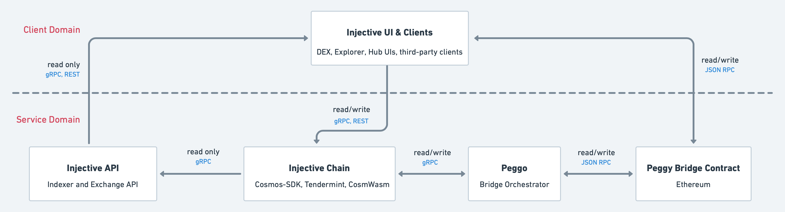

# Injective-Core [](https://codecov.io/gh/InjectiveLabs/injective-core)


[//]: # ([![Project Status: Active -- The project has reached a stable, usable)
[//]: # (state and is being actively)
[//]: # (developed.]&#40;https://img.shields.io/badge/repo%20status-Active-green.svg?style=flat-square&#41;]&#40;https://www.repostatus.org/#active&#41;)
[//]: # ([![GoDoc]&#40;https://img.shields.io/badge/godoc-reference-blue?style=flat-square&logo=go&#41;]&#40;https://pkg.go.dev/github.com/InjectiveLabs/sdk-go/chain&#41;)
[//]: # ([![Discord]&#40;https://badgen.net/badge/icon/discord?icon=discord&label&#41;]&#40;https://discord.gg/injective&#41;)


Home of the following services:

* [injectived](/cmd/injectived)

## Architecture



## Installation

### Building from sources

In order to build from source you’ll need at least [Go 1.16+](https://golang.org/dl/).

```bash
# need to clone if you plan to run tests, and use Makefile
$ git clone git@github.com:InjectiveLabs/injective-core.git
$ cd injective-core
$ make install

# or simply do this to fetch modules and build executables
$ go install github.com/InjectiveLabs/injective-core/cmd/...
```
### Quick Setup
The most convenient way to launch services is by running the setup script:
```bash
$ ./setup.sh
```
Then run an instance of the injectived node.
```bash
$ ./injectived.sh
```

Voila! You have now successfully setup a full node on the Injective Chain.

### Install for MacOS
Note: for any mention of ZSH, replace it with Bash if applicable. for example, `~/.bashrc`

1. Build from source
   ```bash
   git clone https://github.com/OpenDeFiFoundation/injective-core.git
   cd injective-core
   make install
   ```

2. Update `.zshrc` - Add these lines to your `~/.zshrc` file:
   ```bash
   export GOPATH=$HOME/go
   export PATH=$PATH:$(go env GOPATH)/bin
   ```

3. Refresh your `~/.zshrc` file
   ```bash
   source ~/.zshrc
   ```

4. Test to make sure its working
   ```bash
   injectived version
   ```

## Generating the module specification docs
```bash
$ cd docs && yarn && yarn run serve
```
## Generating REST and gRPC Gateway docs
First, ensure that the `Enable` and `Swagger` values are true in APIConfig set in `cmd/injectived/config/config.go`.

Then simply run the following command to auto-generate the Swagger UI docs.
```bash
$ make proto-swagger-gen
```
Then when you start the Injective Daemon, simply navigate to [http://localhost:10337/swagger/](http://localhost:10337/swagger/).

## Generating Injective Chain API gRPC Typescript bindings

```bash
$ make gen
```
Then when you start the Injective Daemon, simply navigate to [http://localhost:10337/swagger/](http://localhost:10337/swagger/).


## Maintenance

To run all unit tests:

```bash
$ go test ./injective-chain/...
```
