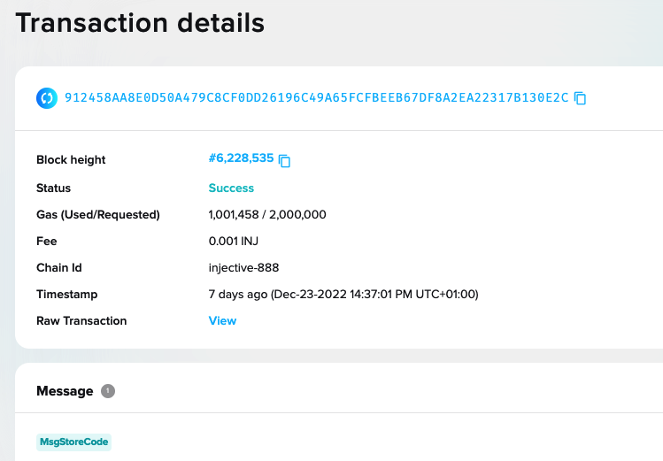

# Your First Injective Smart Contract

This example illustrates the structure of a basic smart contract. The [counter website](https://injective-simple-cosmwasm-sc.netlify.app/) allows you to interact with an instance of the smart contract on the Injective testnet. If you have prior CosmWasm smart contract experience, feel free to skip this section.

The complete smart contract code can be found in this [GitHub repository](https://github.com/InjectiveLabs/cw-counter), and the frontend code can be found [here](https://github.com/InjectiveLabs/injective-simple-sc-counter-ui/tree/master/nuxt) (Vue) or [here](https://github.com/InjectiveLabs/injective-simple-sc-counter-ui/tree/master/next) (React).

## Prerequisites

Before starting, make sure you have [`rustup`](https://rustup.rs/) along with
recent versions of `rustc` and `cargo` installed. Currently, we are testing on Rust v1.58.1+.

You also need to have the `wasm32-unknown-unknown` target installed as well as the `cargo-generate` Rust crate.

You can check versions via the following commands:

```bash
rustc --version
cargo --version
rustup target list --installed
# if wasm32 is not listed above, run this
rustup target add wasm32-unknown-unknown
# to install cargo-generate, run this
cargo install cargo-generate
```

## Objectives

- Create and interact with a smart contract that increases and resets a counter to a given value
- Understand the basics of a CosmWasm smart contract, learn how to deploy it on Injective, and interact with it using [Injective tools](../../tools/index.mdx)

## CosmWasm Contract Basics

A smart contract can be considered an instance of a [singleton object](https://en.wikipedia.org/wiki/Singleton_pattern) whose internal state is persisted on the blockchain. Users can trigger state changes by sending the smart contract JSON messages, and users can also query its state by sending a request formatted as a JSON message. These JSON messages are different than Injective blockchain messages such as `MsgSend` and `MsgExecuteContract`.

As a smart contract writer, your job is to define 3 functions that compose your smart contract's interface:

- `instantiate()`: a constructor which is called during contract instantiation to provide initial state
- `execute()`: gets called when a user wants to invoke a method on the smart contract
- `query()`: gets called when a user wants to get data out of a smart contract

In our [sample counter contract](https://github.com/InjectiveLabs/cw-counter/blob/59b9fed82864103eb704a58d20ddb4bf94c69787/src/msg.rs), we will implement one `instantiate`, one `query`, and two `execute` methods.

## Start with a Template

In your working directory, quickly launch your smart contract with the recommended folder structure and build options by running the following commands:

```bash
cargo generate --git https://github.com/CosmWasm/cw-template.git --branch 1.0 --name my-first-contract
cd my-first-contract
```

This helps get you started by providing the basic boilerplate and structure for a smart contract. In the [`src/contract.rs`](https://github.com/InjectiveLabs/cw-counter/blob/ea3b781447a87f052e4b8308d5c73a30481ed61f/src/contract.rs) file you will find that the standard CosmWasm entrypoints [`instantiate()`](https://github.com/InjectiveLabs/cw-counter/blob/ea3b781447a87f052e4b8308d5c73a30481ed61f/src/contract.rs#L15), [`execute()`](https://github.com/InjectiveLabs/cw-counter/blob/ea3b781447a87f052e4b8308d5c73a30481ed61f/src/contract.rs#L35), and [`query()`](https://github.com/InjectiveLabs/cw-counter/blob/ea3b781447a87f052e4b8308d5c73a30481ed61f/src/contract.rs#L72) are properly exposed and hooked up.

## State

:::info
CosmWasm [State documentation](https://github.com/CosmWasm/docs/blob/archive/dev-academy/develop-smart-contract/01-intro.md#contract-state)
:::

`State` handles the state of the database where smart contract data is stored and accessed.

The [starting template](https://github.com/InjectiveLabs/cw-counter/blob/ea3b781447a87f052e4b8308d5c73a30481ed61f/src/state.rs) has the following basic state, a singleton struct `State` containing:

- `count`, a 32-bit integer with which `execute()` messages will interact by increasing or resetting it.
- `owner`, the sender `address` of the `MsgInstantiateContract`, which will determine if certain execution messages are permitted.

```c
// src/state.rs
use schemars::JsonSchema;
use serde::{Deserialize, Serialize};

use cosmwasm_std::Addr;
use cw_storage_plus::Item;

#[derive(Serialize, Deserialize, Clone, Debug, PartialEq, JsonSchema)]
pub struct State {
    pub count: i32,
    pub owner: Addr,
}

pub const STATE: Item<State> = Item::new("state");
```

Injective smart contracts have the ability to keep persistent state through Injective's native LevelDB, a bytes-based key-value store. As such, any data you wish to persist should be assigned a unique key, which may be used to index and retrieve the data.

Data can only be persisted as raw bytes, so any notion of structure or data type must be expressed as a pair of serializing and deserializing functions. For instance, objects must be stored as bytes, so you must supply both the function that encodes the object into bytes to save it on the blockchain, as well as the function that decodes the bytes back into data types that your contract logic can understand. The choice of byte representation is up to you, so long as it provides a clean, bi-directional mapping.

Fortunately, the CosmWasm team has provided utility crates such as [`cosmwasm_storage`](https://crates.io/crates/cosmwasm-storage), which provides convenient high-level abstractions for data containers such as a "singleton" and "bucket", which automatically provide serialization and deserialization for commonly-used types such as structs and Rust numbers. For a more efficient storage mechanism, the team has also provided the [`cw-storage-plus`](https://docs.cosmwasm.com/docs/smart-contracts/state/cw-plus/) crate.

Notice how the `State` struct holds both `count` and `owner`. In addition, the `derive` attribute is applied to auto-implement some useful traits:

- `Serialize`: provides serialization
- `Deserialize`: provides deserialization
- `Clone`: makes the struct copyable
- `Debug`: enables the struct to be printed to string
- `PartialEq`: provides equality comparison
- `JsonSchema`: auto-generates a JSON schema

`Addr` refers to a human-readable Injective address prefixed with `inj`, e.g. `inj1clw20s2uxeyxtam6f7m84vgae92s9eh7vygagt`.

## InstantiateMsg

:::info
CosmWasm [InstantiateMsg documentation](https://github.com/CosmWasm/docs/blob/archive/dev-academy/develop-smart-contract/01-intro.md#instantiatemsg)
:::

The `InstantiateMsg` is provided to the contract when a user instantiates a contract on the blockchain through a `MsgInstantiateContract`. This provides the contract with its configuration as well as its initial state.

On the Injective blockchain, the uploading of a contract's code and the instantiation of a contract are regarded as separate events, unlike on Ethereum. This is to allow a small set of vetted contract archetypes to exist as multiple instances sharing the same base code, but be configured with different parameters (imagine one canonical ERC20, and multiple tokens that use its code).

### Example

For your contract, the contract creator is expected to supply the initial state in a JSON message. We can see in the message definition below that the message holds one parameter `count`, which represents the initial count.

```json
{
  "count": 100
}
```

### Message Definition

```c
// src/msg.rs

use schemars::JsonSchema;
use serde::{Deserialize, Serialize};

#[derive(Serialize, Deserialize, Clone, Debug, PartialEq, JsonSchema)]
pub struct InstantiateMsg {
    pub count: i32,
}

```

### Contract Logic

In `contract.rs`, you will define your first entry-point, `instantiate()`, or where the contract is instantiated and passed its `InstantiateMsg`. Extract the count from the message and set up your initial state where:

- `count` is assigned the count from the message
- `owner` is assigned to the sender of the `MsgInstantiateContract`

```c
// src/contract.rs
#[cfg_attr(not(feature = "library"), entry_point)]
pub fn instantiate(
    deps: DepsMut,
    _env: Env,
    info: MessageInfo,
    msg: InstantiateMsg,
) -> Result<Response, ContractError> {
    let state = State {
        count: msg.count,
        owner: info.sender.clone(),
    };
    set_contract_version(deps.storage, CONTRACT_NAME, CONTRACT_VERSION)?;
    STATE.save(deps.storage, &state)?;

    Ok(Response::new()
        .add_attribute("method", "instantiate")
        .add_attribute("owner", info.sender)
        .add_attribute("count", msg.count.to_string()))
}
```

## ExecuteMsg

:::info
CosmWasm [ExecuteMsg documentation](https://github.com/CosmWasm/docs/blob/archive/tutorials/simple-option/develop.md#executemsg-executemsg)
:::

The `ExecuteMsg` is a JSON message passed to the `execute()` function through a `MsgExecuteContract`. Unlike the `InstantiateMsg`, the `ExecuteMsg` can exist as several different types of messages to account for the different types of functions that a smart contract can expose to a user. The [`execute()` function](https://github.com/InjectiveLabs/cw-counter/blob/ea3b781447a87f052e4b8308d5c73a30481ed61f/src/contract.rs#L35) demultiplexes these different types of messages to its appropriate message handler logic.

We have [two ExecuteMsg](https://github.com/InjectiveLabs/cw-counter/blob/59b9fed82864103eb704a58d20ddb4bf94c69787/src/msg.rs#L9): `Increment` and `Reset`.

- `Increment` has no input parameter and increases the value of count by 1.
- `Reset` takes a 32-bit integer as a parameter and resets the value of `count` to the input parameter.

### Example

#### Increment

Any user can increment the current count by 1.

```json
{
  "increment": {}
}
```

#### Reset

Only the owner can reset the count to a specific number. See [Logic](#logic) below for the implementation details.

```json
{
  "reset": {
    "count": 5
  }
}
```

### Message Definition

For `ExecuteMsg`, an `enum` can be used to multiplex over the different types of messages that your contract can understand. The `serde` attribute rewrites your attribute keys in snake case and lower case, so you'll have `increment` and `reset` instead of `Increment` and `Reset` when serializing and deserializing across JSON.

```c
// src/msg.rs

#[derive(Serialize, Deserialize, Clone, Debug, PartialEq, JsonSchema)]
#[serde(rename_all = "snake_case")]
pub enum ExecuteMsg {
    Increment {},
    Reset { count: i32 },
}
```

### Logic

```c
// src/contract.rs

#[cfg_attr(not(feature = "library"), entry_point)]
pub fn execute(
    deps: DepsMut,
    _env: Env,
    info: MessageInfo,
    msg: ExecuteMsg,
) -> Result<Response, ContractError> {
    match msg {
        ExecuteMsg::Increment {} => try_increment(deps),
        ExecuteMsg::Reset { count } => try_reset(deps, info, count),
    }
}
```

This is your `execute()` method, which uses Rust's pattern matching to route the received `ExecuteMsg` to the appropriate handling logic, either dispatching a `try_increment()` or a `try_reset()` call depending on the message received.

```c
pub fn try_increment(deps: DepsMut) -> Result<Response, ContractError> {
    STATE.update(deps.storage, |mut state| -> Result<_, ContractError> {
        state.count += 1;
        Ok(state)
    })?;

    Ok(Response::new().add_attribute("method", "try_increment"))
}
```

First, it acquires a mutable reference to the storage to update the item located at key `state`. It then updates the state's count by returning an `Ok` result with the new state. Finally, it terminates the contract's execution with an acknowledgement of success by returning an `Ok` result with the `Response`.

```c
// src/contract.rs

pub fn try_reset(deps: DepsMut, info: MessageInfo, count: i32) -> Result<Response, ContractError> {
    STATE.update(deps.storage, |mut state| -> Result<_, ContractError> {
        if info.sender != state.owner {
            return Err(ContractError::Unauthorized {});
        }
        state.count = count;
        Ok(state)
    })?;
    Ok(Response::new().add_attribute("method", "reset"))
}
```

The logic for reset is very similar to increment—except this time, it first checks that the message sender is permitted to invoke the reset function (in this case, it must be the contract owner).

## QueryMsg

:::info
CosmWasm [QueryMsg documentation](https://docs.cosmwasm.com/docs/smart-contracts/query)
:::

The `GetCount` [query message](https://github.com/InjectiveLabs/cw-counter/blob/59b9fed82864103eb704a58d20ddb4bf94c69787/src/msg.rs#L16) has no parameters and returns the `count` value.

See the implementation details in [Logic](#logic-1) below.

### Example

The template contract only supports one type of `QueryMsg`:

#### GetCount

The request:

```json
{
  "get_count": {}
}
```

Which should return:

```json
{
  "count": 5
}
```

### Message Definition

To support data queries in the contract, you'll have to define both a `QueryMsg` format (which represents requests), as well as provide the structure of the query's output—`CountResponse` in this case. You must do this because `query()` will send information back to the user through structured JSON, so you must make the shape of your response known. See [Generating JSON Schema](#generating-json-schema) for more info.

Add the following to your `src/msg.rs`:

```c
// src/msg.rs
#[derive(Serialize, Deserialize, Clone, Debug, PartialEq, JsonSchema)]
#[serde(rename_all = "snake_case")]
pub enum QueryMsg {
    // GetCount returns the current count as a json-encoded number
    GetCount {},
}

// Define a custom struct for each query response
#[derive(Serialize, Deserialize, Clone, Debug, PartialEq, JsonSchema)]
pub struct CountResponse {
    pub count: i32,
}
```

### Logic

The logic for `query()` is similar to that of `execute()`; however, since `query()` is called without the end-user making a transaction, the `env` argument is omitted as no information is necessary.

```c
// src/contract.rs

#[cfg_attr(not(feature = "library"), entry_point)]
pub fn query(deps: Deps, _env: Env, msg: QueryMsg) -> StdResult<Binary> {
    match msg {
        QueryMsg::GetCount {} => to_binary(&query_count(deps)?),
    }
}

fn query_count(deps: Deps) -> StdResult<CountResponse> {
    let state = STATE.load(deps.storage)?;
    Ok(CountResponse { count: state.count })
}
```

## Unit test

Unit tests should be run as the first line of assurance before deploying the code on chain. They are quick to execute and can provide helpful backtraces on failures with the `RUST_BACKTRACE=1` flag:

```c
cargo unit-test // run this with RUST_BACKTRACE=1 for helpful backtraces
```

You can find the [unit test implementation](https://github.com/InjectiveLabs/cw-counter/blob/59b9fed82864103eb704a58d20ddb4bf94c69787/src/contract.rs#L88) at `src/contract.rs`

## Building the Contract

Now that we understand and have tested the contract, we can run the following command to build the contract. This will check for any preliminary errors before we optimize the contract in the next step.

```bash
cargo wasm
```

Next, we must optimize the contract in order to ready the code for upload to the chain.

:::info
Read more details on [preparing the Wasm bytecode for production](https://github.com/InjectiveLabs/cw-counter/blob/59b9fed82864103eb704a58d20ddb4bf94c69787/Developing.md#preparing-the-wasm-bytecode-for-production)
:::

CosmWasm has [rust-optimizer](https://github.com/CosmWasm/rust-optimizer), an optimizing compiler that can produce a small and consistent build output. The easiest method to use the tool is to use a published Docker image—check [here](https://hub.docker.com/r/cosmwasm/rust-optimizer/tags) for the latest x86 version, or [here](https://hub.docker.com/r/cosmwasm/rust-optimizer-arm64/tags) for the latest ARM version. With Docker running, run the following command to mount the contract code to `/code` and optimize the output (you can use an absolute path instead of `$(pwd)` if you don't want to `cd` to the directory first):

```bash
docker run --rm -v "$(pwd)":/code \
  --mount type=volume,source="$(basename "$(pwd)")_cache",target=/code/target \
  --mount type=volume,source=registry_cache,target=/usr/local/cargo/registry \
  cosmwasm/rust-optimizer:0.12.12
```

If you're on an ARM64 machine, you should use a docker image built for ARM64:

```bash
docker run --rm -v "$(pwd)":/code \
  --mount type=volume,source="$(basename "$(pwd)")_cache",target=/code/target \
  --mount type=volume,source=registry_cache,target=/usr/local/cargo/registry \
  cosmwasm/rust-optimizer-arm64:0.12.12
```

:::note
CosmWasm does not recommend using the ARM64 version of the compiler because it produces different Wasm artifacts from the Intel/AMD version. For release/production, only contracts built with Intel/AMD optimizers are recommended for use. See [here](https://github.com/CosmWasm/rust-optimizer#notice) for the note from CosmWasm.
:::

:::caution tip
You may receive an `` Unable to update registry `crates-io` `` error while running the command. Try adding the following lines to the `Cargo.toml` file located within the contract directory and running the command again:

```toml
[net]
git-fetch-with-cli = true
```

See [The Cargo Book](https://doc.rust-lang.org/cargo/reference/config.html#netgit-fetch-with-cli) for more information.
:::

This produces an `artifacts` directory with a `PROJECT_NAME.wasm`, as well as
`checksums.txt`, containing the Sha256 hash of the Wasm file.
The Wasm file is compiled deterministically (anyone else running the same
docker on the same git commit should get the identical file with the same Sha256 hash).

## Install `injectived`

In this section, you will install `injectived`, create an account programmatically, and fund it to prepare for launching the smart contract on chain.

:::info
[`injectived`](../../tools/injectived/02_using.md) is the command-line interface and daemon that connects to Injective and enables you to interact with the Injective blockchain.
:::

A Docker image has been prepared to make this tutorial easier. Alternatively, you can follow the [installation instructions](../../tools/injectived/install) for `injectived` and run it locally.

:::tip
If you install `injectived` from the binary, ignore the docker commands.
On the [public endpoints section](https://docs.injective.network/develop/public-endpoints) you can find the right --node info to interact with Mainnet and Testnet.
:::

Executing this command will make the docker container execute indefinitely.

```bash
docker run --name="injective-core-staging" \
-v=<directory_to_which_you_cloned_cw-template>/artifacts:/var/artifacts \
--entrypoint=sh public.ecr.aws/l9h3g6c6/injective-core:staging \
-c "tail -F anything"
```

Note: `directory_to_which_you_cloned_cw-template` must be an absolute path. The absolute path can easily be found by running the `pwd` command from inside the CosmWasm/cw-counter directory.

Open a new terminal and go into the Docker container to initialize the chain:

```bash
docker exec -it injective-core-staging sh
```

Let’s start by adding `jq` dependency, which will be needed later on:

```bash
# inside the "injective-core-staging" container
apk add jq
```

Now we can proceed to local chain initialization and add a test user called `testuser` (when prompted use 12345678 as password). We will only use the test user to generate a new private key that will later on be used to sign messages on the testnet:

```sh
# inside the "injective-core-staging" container
injectived keys add testuser
```

**OUTPUT**

```
- name: testuser
  type: local
  address: inj1exjcp8pkvzqzsnwkzte87fmzhfftr99kd36jat
  pubkey: '{"@type":"/injective.crypto.v1beta1.ethsecp256k1.PubKey","key":"Aqi010PsKkFe9KwA45ajvrr53vfPy+5vgc3aHWWGdW6X"}'
  mnemonic: ""

**Important** write this mnemonic phrase in a safe place.
It is the only way to recover your account if you ever forget your password.

wash wise evil buffalo fiction quantum planet dial grape slam title salt dry and some more words that should be here
```

Take a moment to write down the address or export it as an env variable, as you will need it to proceed:

```bash
# inside the "injective-core-staging" container
export INJ_ADDRESS= <your inj address>
```

:::info
Fund your recently generated test address with the [Injective test faucet](https://faucet.injective.network/).
:::

Now you have successfully created `testuser` on Injective Testnet. The `testuser` address should have `10000000000000000000` INJ balance.

To confirm, search for your address on the [Injective Testnet Explorer](https://testnet.explorer.injective.network/) to check your balance.

Alternatively, you can verify it by querying the bank balance - [https://k8s.testnet.lcd.injective.network/swagger/#/Query/AllBalances](https://k8s.testnet.lcd.injective.network/swagger/#/Query/AllBalances) or with curl:

```bash
curl -X GET "https://k8s.testnet.lcd.injective.network/cosmos/bank/v1beta1/balances/<your_INJ_address>" -H "accept: application/json"
```

## Upload the Wasm Contract

In this section, we will upload the .wasm file that you compiled in the previous steps to the Injective Testnet.

```bash
# inside the "injective-core-staging" container, or from the contract directory if running injectived locally
yes 12345678 | injectived tx wasm store artifacts/my_first_contract.wasm \
--from=$(echo $INJ_ADDRESS) \
--chain-id="injective-888" \
--yes --fees=1000000000000000inj --gas=2000000 \
--node=https://k8s.testnet.tm.injective.network:443
```

**Output:**

```bash
code: 0
codespace: ""
data: ""
events: []
gas_used: "0"
gas_wanted: "0"
height: "0"
info: ""
logs: []
raw_log: '[]'
timestamp: ""
tx: null
txhash: 912458AA8E0D50A479C8CF0DD26196C49A65FCFBEEB67DF8A2EA22317B130E2C
```

Check your address on the [Injective Testnet Explorer](https://testnet.explorer.injective.network), and look for a transaction with the `txhash` returned from storing the code on chain. The transaction type should be `MsgStoreCode`.



You can see all stored codes on Injective Testnet under [Code](https://testnet.explorer.injective.network/codes/).

:::tip
There are different ways to find the code that you just stored:

1. Look for the TxHash on the Injective Explorer [codes list](https://testnet.explorer.injective.network/codes/); it is most likely the most recent.
2. Use `injectived` to query transaction info.
   :::

To query the transaction use the `txhash` and verify the contract was deployed.

```sh
injectived query tx 912458AA8E0D50A479C8CF0DD26196C49A65FCFBEEB67DF8A2EA22317B130E2C --node=https://k8s.testnet.tm.injective.network:443
```

Inspecting the output more closely, we can see the `code_id` of `290` for the uploaded contract:

```bash
- events:
  - attributes:
    - key: access_config
      value: '{"permission":"Everybody","address":""}'
    - key: checksum
      value: '"+OdoniOsDJ1T9EqP2YxobCCwFAqNdtYA4sVGv7undY0="'
    - key: code_id
      value: '"290"'
    - key: creator
      value: '"inj1h3gepa4tszh66ee67he53jzmprsqc2l9npq3ty"'
    type: cosmwasm.wasm.v1.EventCodeStored
  - attributes:
    - key: action
      value: /cosmwasm.wasm.v1.MsgStoreCode
    - key: module
      value: wasm
    - key: sender
      value: inj1h3gepa4tszh66ee67he53jzmprsqc2l9npq3ty
    type: message
  - attributes:
    - key: code_id
      value: "290"
    type: store_code
```

Let's export your `code_id` as an ENV variable—we'll need it to instantiate the contract. You can skip this step and manually add it later, but keep note of the ID.

```bash
export CODE_ID= <code_id of your stored contract>
```

## Generating JSON Schema

While the Wasm calls `instantiate`, `execute`, and `query` accept JSON, this is not enough information to use them. We need to expose the schema for the expected messages to the clients.

In order to make use of JSON-schema auto-generation, you should register each of the data structures that you need schemas for.

```c
// examples/schema.rs

use std::env::current_dir;
use std::fs::create_dir_all;

use cosmwasm_schema::{export_schema, remove_schemas, schema_for};

use my_first_contract::msg::{CountResponse, HandleMsg, InitMsg, QueryMsg};
use my_first_contract::state::State;

fn main() {
    let mut out_dir = current_dir().unwrap();
    out_dir.push("schema");
    create_dir_all(&out_dir).unwrap();
    remove_schemas(&out_dir).unwrap();

    export_schema(&schema_for!(InstantiateMsg), &out_dir);
    export_schema(&schema_for!(ExecuteMsg), &out_dir);
    export_schema(&schema_for!(QueryMsg), &out_dir);
    export_schema(&schema_for!(State), &out_dir);
    export_schema(&schema_for!(CountResponse), &out_dir);
}
```

The schemas can then be generated with

```bash
cargo schema
```

which will output 5 files in `./schema`, corresponding to the 3 message types the contract accepts, the query response message, and the internal `State`.

These files are in standard JSON Schema format, which should be usable by various
client side tools, either to auto-generate codecs, or just to validate incoming
JSON with respect to the defined schema.

Take a minute to generate the schema ([take a look at it here](https://github.com/InjectiveLabs/cw-counter/blob/master/schema/cw-counter.json)) and get familiar with it, as you will need to it for the next steps.

## Instantiate the Contract

Now that we have the code on chain, it is time to instantiate the contract to be able to interact with it.

:::info Reminder
On CosmWasm, the upload of a contract's code and the instantiation of a contract are regarded as separate events.
:::

To instantiate the contract, run the following CLI command with the code_id you got in the previous step, along with the [JSON encoded initialization arguments](https://github.com/InjectiveLabs/cw-counter/blob/ea3b781447a87f052e4b8308d5c73a30481ed61f/schema/cw-counter.json#L7) and a label (a human-readable name for this contract in lists).

```bash
INIT='{"count":99}'
yes 12345678 | injectived tx wasm instantiate $CODE_ID $INIT \
--label="CounterTestInstance" \
--from=$(echo $INJ_ADDRESS) \
--chain-id="injective-888" \
--yes --fees=1000000000000000inj \
--gas=2000000 \
--no-admin \
--node=https://k8s.testnet.tm.injective.network:443
```

**Output:**

```bash
code: 0
codespace: ""
data: ""
events: []
gas_used: "0"
gas_wanted: "0"
height: "0"
info: ""
logs: []
raw_log: '[]'
timestamp: ""
tx: null
txhash: 01804F525FE336A5502E3C84C7AE00269C7E0B3DC9AA1AB0DDE3BA62CF93BE1D
```

:::info
You can find the contract address and metadata by:

- Looking on the [Testnet Explorer](https://testnet.explorer.injective.network/contracts/)
- Querying the [ContractsByCode](https://k8s.testnet.lcd.injective.network/swagger/#/Query/ContractsByCode) and [ContractInfo](https://k8s.testnet.lcd.injective.network/swagger/#/Query/ContractInfo) APIs
- Querying through the CLI

```bash
injectived query wasm contract inj1ady3s7whq30l4fx8sj3x6muv5mx4dfdlcpv8n7 --node=https://k8s.testnet.tm.injective.network:443
```

:::

## Querying the Contract

As we know from [earlier](#querymsg), the only QueryMsg we have is `get_count`.

```bash
GET_COUNT_QUERY='{"get_count":{}}'
injectived query wasm contract-state smart inj1ady3s7whq30l4fx8sj3x6muv5mx4dfdlcpv8n7 "$GET_COUNT_QUERY" \
--node=https://k8s.testnet.tm.injective.network:443 \
--output json
```

**Output:**

```bash
{"data":{"count":99}}
```

We see that `count` is 99, as set when we [instantiated the contract](#instantiate-the-contract).

:::note
If you query the same contract, you may receive a different response as others may have interacted with the contract and incremented or reset the count.
:::

## Execute the Contract

Let's now interact with the contract by incrementing the counter.

```bash
INCREMENT='{"increment":{}}'
yes 12345678 | injectived tx wasm execute inj1ady3s7whq30l4fx8sj3x6muv5mx4dfdlcpv8n7 "$INCREMENT" --from=$(echo $INJ_ADDRESS) \
--chain-id="injective-888" \
--yes --fees=1000000000000000inj --gas=2000000 \
--node=https://k8s.testnet.tm.injective.network:443 \
--output json
```

If we [query](#querying-the-contract) the contract for the count, we see:

```bash
{"data":{"count":100}}
```

- <strong>yes 12345678 | </strong> automatically pipes (passes) the passphrase to the input of <strong>injectived tx wasm execute</strong> so you do not need to enter it manually.

To reset the counter:

```bash
RESET='{"reset":{"count":999}}'
yes 12345678 | injectived tx wasm execute inj1ady3s7whq30l4fx8sj3x6muv5mx4dfdlcpv8n7 "$RESET" \
--from=$(echo $INJ_ADDRESS) \
--chain-id="injective-888" \
--yes --fees=1000000000000000inj --gas=2000000 \
--node=https://k8s.testnet.tm.injective.network:443 \
--output json
```

Now, if we [query](#querying-the-contract) the contract again, we see the count has been reset to the provided value:

```bash
{"data":{"count":999}}
```

## Calling Cosmos SDK Native Messages

In addition to defining custom smart contract logic, CosmWasm also allows contracts to interact with the underlying Cosmos SDK functionalities. One common use case is to send tokens from the contract to a specified address using the Cosmos SDK's bank module.

### Example: Bank Send

The `BankMsg::Send` message allows the contract to transfer tokens to another address. This can be useful in various scenarios, such as distributing rewards or returning funds to users.

:::note
If you want to send funds and execute a function on another contract at the same time, don't use BankMsg::Send. Instead, use WasmMsg::Execute and set the respective funds field.
:::

### Constructing the Message

You can construct a `BankMsg::Send` message within your contract's `execute` function. This message requires specifying the recipient address and the amount to send. Here's an example of how to construct this message:

```rust
use cosmwasm_std::{BankMsg, Coin, Response, MessageInfo};

pub fn try_send(
    info: MessageInfo,
    recipient_address: String,
    amount: Vec<Coin>,
) -> Result<Response, ContractError> {
    let send_message = BankMsg::Send {
        to_address: recipient_address,
        amount,
    };

    let response = Response::new().add_message(send_message);
    Ok(response)
}
```

### Usage in a Smart Contract

In your contract, you can add a new variant to your ExecuteMsg enum to handle this bank send functionality. For example:

```rust
#[derive(Serialize, Deserialize, Clone, Debug, PartialEq, JsonSchema)]
#[serde(rename_all = "snake_case")]
pub enum ExecuteMsg {
    // ... other messages ...
    SendTokens { recipient: String, amount: Vec<Coin> },
}
```

Then, in the `execute` function, you can add a case to handle this message:

```rust
#[cfg_attr(not(feature = "library"), entry_point)]
pub fn execute(
    deps: DepsMut,
    env: Env,
    info: MessageInfo,
    msg: ExecuteMsg,
) -> Result<Response, ContractError> {
    match msg {
        // ... other message handling ...
        ExecuteMsg::SendTokens { recipient, amount } => try_send(info, recipient, amount),
    }
}
```

## Testing

As with other smart contract functions, you should add unit tests to ensure your bank send functionality works as expected. This includes testing different scenarios, such as sending various token amounts and handling errors correctly.

You may use [test-tube](https://github.com/InjectiveLabs/test-tube) for running integration tests that include a local Injective chain.

Congratulations! You've created and interacted with your first Injective smart contract and now know how to get started with CosmWasm development on Injective. Continue to [Creating a Frontend for Your Contract](create-a-frontend.md) for a guide on creating a web UI.

<br/>
<sub><sup><sub><sup>This work has been modified from its original source.</sup></sub></sup></sub>
