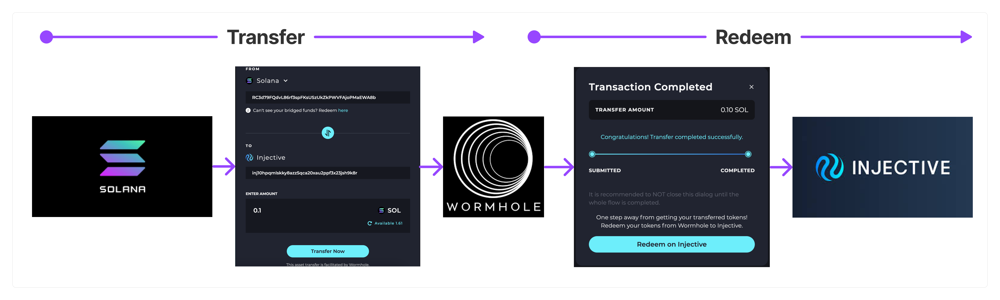

# Injective Wormhole Bridge

The Injective Wormhole Bridge allows you to bridge tokens across different chains. Instead of swapping or converting assets directly, Wormhole locks your source assets in a [smart contract](https://hub.injective.network/proposal/184) and mints new Wormhole-wrapped assets on Injective.

If you are interested in the technical details of this integration, check on the [Injective adapter contract](https://github.com/InjectiveLabs/cw20-adapter), which can be used to transform CW20 tokens into [new bank denom tokens](https://docs.injective.network/develop/modules/Injective/tokenfactory/).

:::info
All source chains have the same steps to bridge (transfer and redeem), but the experience and the time it takes to confirm transactions can differ based on the source chain.

For example, *Ethereum to Injective* will be slower than *Solana to Injective* and will show a different UX to guide you through the process.
:::

## Where can I see my transactions?

All your **Completed**, **In Progress** and **Failed/Canceled** transactions are in the History section at the bottom of the [Injective Hub bridge page](https://hub.injective.network/bridge).
