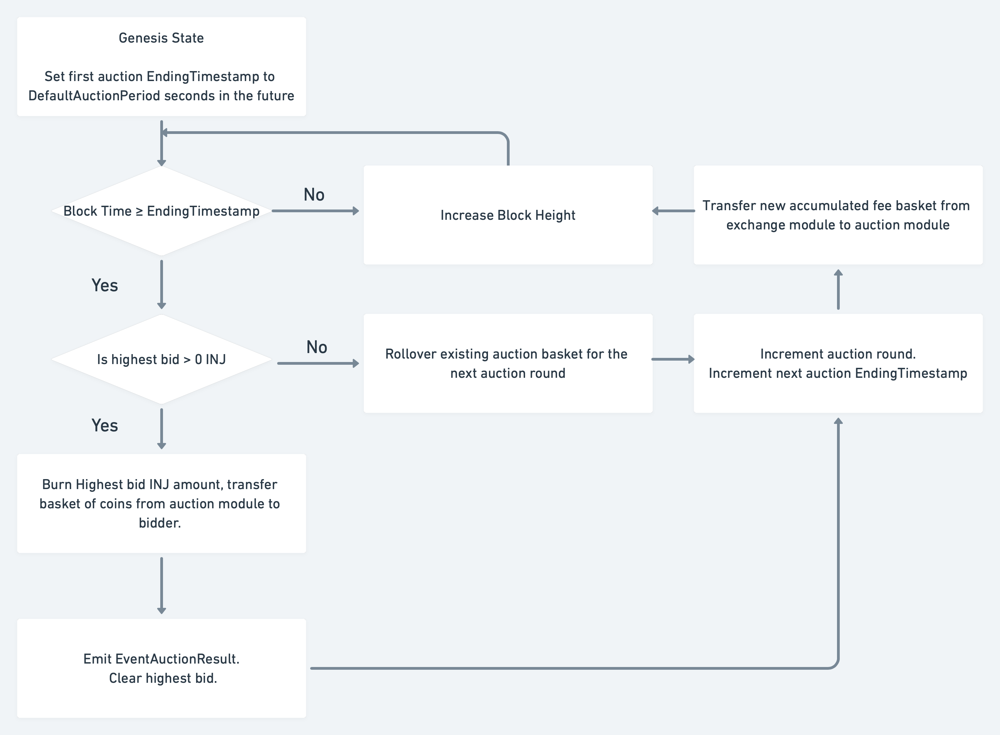

# End-Block

### Auction Settlement

The settlement of a given auction round occurs when `blockTime ≥ EndingTimeStamp.` If a non-zero INJ bid was placed during this period (i.e. there exists a `LastBid`), the following procedure will take place: 

- The winning INJ bid amount is burned.
- The basket of coins held by the auction module is transferred to the winning bidder. 
- `LastAuctionResult` is written to state and `EventAuctionResult` is emitted.
- The `LastBid` is cleared.
- The AuctionRound is incremented by 1 and the EndingTimestamp is incremented by `AuctionPeriod`. 
- The accumulated exchange fees are transferred from the `exchange` module to the `auction` module for the new upcoming auction. 

If the round closed without any successful bids, the existing coin basket will be rolled over into the next auction and combined with the new accumulated fee basket. 

