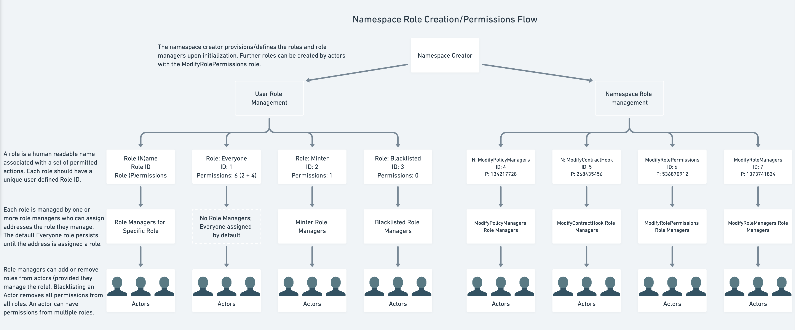
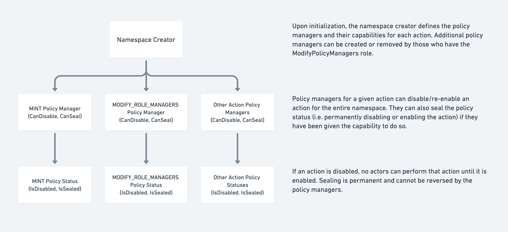

# Key Concepts

## Overview
The `Permissions` module enables the creation of permissioned assets through an RBAC (Role-Based Access Control) system. The module serves as a primitive to launch any asset requiring varying levels of permissions such as stablecoins (issued by centralized entities), tokenized Treasuries, and other RWAs (Real World Assets).

Supported features include restrictions on sending/receiving (freezing assets), control over access to minting and burning, pausing specific actions across all addresses, administrative actions management, and support for Wasm contract hooks for further development on top of the module.

## How the `Permissions` Module Works

### Relation to `TokenFactory` Module

The `Permissions` module is tightly coupled with the `TokenFactory` module. It allows users to create restrictions on sending, receiving, minting, and burning of a specific `TokenFactory` token by creating a namespace for the token denom, in which actions are assigned to roles, and roles are assigned to addresses. In this manner, only addresses with the correct roles are permitted to carry out the corresponding actions. The module essentially builds an optional permissions layer on top of `TokenFactory` denoms.

Since the `Permissions` module relies on the existence of a `TokenFactory` denom to function, the `TokenFactory` denom should be launched first, followed by the creation of a `Permissions` namespace.

- See https://docs.injective.network/developers/modules/injective/tokenfactory for documentation on the `TokenFactory` module
- See https://docs.injective.network/guides/launch-a-token for a guide on launching a token with the module
    - Note: The `TokenFactory` admin should not be changed to the null address (inj1qqqqqqqqqqqqqqqqqqqqqqqqqqqqqqqqe2hm49) because the `Permissions` module requires the creator of the  `Permissions` namespace to be the admin of the corresponding `TokenFactory` denom.

Once the `TokenFactory` denom is live and a `Permissions` namespace is created for the token, checks are performed during token mint, burn, send, and receive to ensure the correct permissions are in place for the relevant action.

### Components of a Namespace

As an implementation of an RBAC system for permissioned assets, the `Permissions` module defines several basic actions that can be assigned to roles within a namespace. A namespace serves as the container for all rules, parameters, and assigned permissions for a single asset. Note that each asset (denom) can only have one namespace.

At its core, a namespace comprises:

- Denom
- Actions
- Roles
- Role Managers
- Role Actors
- Policy Statuses
- Policy Managers
- Wasm Contract Hook

**Denom**

- The denomination of the `TokenFactory` asset. The denom in the namespace corresponds to the `TokenFactory` asset with the same name, of which the creator of the namespace is also the admin of the `TokenFactory` asset

**Actions**

- Actions are mapped/assigned to roles to give the role permission to execute the action
- Actions are split into two categories, user actions and namespace management actions. The following is a list of all possible permissioned actions in a namespace:
    - User Actions:
        - `MINT` - Can mint to any address using the `receiver` field as long as that address has permissions for the `RECEIVE` action. If unspecified, the default address is the message sender’s address
        - `RECEIVE` - The address is able to receive tokens
        - `BURN` - Burn own funds
        - `SEND` - Can send to any address with `RECEIVE` permissions
        - `SUPER_BURN` - Burn funds from anyone’s wallet except own wallet, unless the user also has Burn permissions
    - Namespace Management Actions:
        - `MODIFY_POLICY_MANAGERS` - Change the policy managers and their capabilities (if they can disable or seal) within the namespace
        - `MODIFY_CONTRACT_HOOK` - Change the Wasm contract hook
        - `MODIFY_ROLE_PERMISSIONS` - Change the mapping of roles to permitted actions (change what each role is allowed to do)
        - `MODIFY_ROLE_MANAGERS` - Change the managers that determine who can have a role
- Actions are identified by a unique power of 2 integer (for internal bitmasking purposes):
    - `MINT` = 1
    - `RECEIVE` = 2
    - `BURN` = 4
    - `SEND` = 8
    - `SUPER_BURN` = 16
    - `MODIFY_POLICY_MANAGERS` = 134217728
    - `MODIFY_CONTRACT_HOOK` = 268435456
    - `MODIFY_ROLE_PERMISSIONS` = 536870912
    - `MODIFY_ROLE_MANAGERS` = 1073741824
- Permissions are identified by the sum of all permitted action values in base 10
    - E.g. permission to receive, burn, and send would be 14 (2 + 4 + 8)

**Roles**

- Roles consist of a subset of actions (permissions) for which an actor is permitted to carry out. Each role can have zero, one, or multiple actions assigned by a Role Manager
- A role’s actions represent the permitted actions for which an address assigned the role can execute. In other words, roles give permission to perform the actions specified by the role
- Roles are created when the namespace is launched or upon updating the namespace with new role-action mappings by a user permitted to execute the `MODIFY_ROLE_PERMISSIONS` action
- Roles are generally namespace (admin) defined, though there are two special types of roles:
    - `EVERYONE` Role
        - There is a default `EVERYONE` role assigned to all addresses that do not have any other roles
        - If no roles are assigned to an actor, then the `EVERYONE` role applies until they are assigned another role, at which point the `EVERYONE` role ceases to apply
        - Note that this role does not have to be assigned any permissions, though **the `EVERYONE` role must be defined at creation time** (it can be defined with no actions assigned)
        - The `EVERYONE` role is not allowed to have permissions for `MINT`, `SUPER_BURN`, or any of the namespace management actions. This means only `SEND`, `RECEIVE`, and `BURN` are permitted actions to be assigned to the `EVERYONE` role
    - Blacklist Role
        - Any role that has no permitted actions (including `EVERYONE`) will be considered a blacklist role. The blacklist role can be called any unique name.
        - Blacklist roles supercede all other roles such that any address assigned a blacklist role will have all permissions revoked until the address is no longer blacklisted
        - If the blacklist role is removed from the address, all other roles/permissions the address previously had will be reinstated
            - In the case of `EVERYONE` having no permissions, once an address receives another non-blacklist role, the address will no longer have zero permissions/be blacklisted since `EVERYONE` only applies when there are no other roles

**Role Managers**

- Role managers have the ability to assign roles to other addresses (role actors)
- For each role defined within the namespace, one or more role managers are needed to manage the list of addresses for a particular role
    - This includes roles for namespace management actions:
        - `MODIFY_POLICY_MANAGERS` Role Managers
        - `MODIFY_CONTRACT_HOOK` Role Managers
        - `MODIFY_ROLE_PERMISSIONS` Roles Managers
        - `MODIFY_ROLE_MANAGERS` Role Managers
- The role manager can only assign roles for which they are the specific role manager of
- An address can be a role manager of multiple roles at the same time

**Role Actors**

- Role actors, or simply actors, are addresses that have been given one or more roles by the respective role managers
- Role actors are permitted to execute any action for which any of their roles allow
    - For example, if role ABC had permissions to mint, send, and receive, then any role actor with role ABC would be permitted to `mint`, `send`, and `receive` the namespace asset. Suppose role XYZ had `burn` and `mint` permissions, and an actor had role ABC as well as XYZ. Then the actor would be permitted to `mint`, `send`, `receive`, and `burn` the asset.

**Policy Statuses**

- Each action has a policy status associated with it which can be enabled/disabled and/or sealed (can be enabled or disabled without being sealed, or can be enabled or disabled and sealed). Internally, this consists of two booleans for `IsDisabled` and `IsSealed`
    - Actions are not disabled and not sealed by default
- The policy status determines the status of an action across the entire namespace. If an action policy is disabled, no user will be able to execute the action until it is enabled again
- Sealing a user action policy will irreversibly set the action policy for `IsDisabled`
    - **Note: Sealing a namespace management action (**`MODIFY_POLICY_MANAGERS`**,** `MODIFY_CONTRACT_HOOK`**,** `MODIFY_ROLE_PERMISSIONS`**,** `MODIFY_ROLE_MANAGERS`**) policy will result in the action being permanently disabled. While user actions and namespace management actions can both be sealed as enabled, the resulting behavior of the respective namespace management actions will be effectively permanently disabled, while user actions will be permanently enabled.**

**Policy Managers**

- Policy managers are in charge of setting the policy status for their approved actions.
- When the policy managers for an action are set, they can be given permission to disable and/or seal the action policy through the `PolicyManagerCapabilities` field.
    - Policy manager capabilities describe whether an address (the policy manager) can disable or seal an action. Another way to put it: they describe the extent to which a policy manager can alter the policy state of an action.
    - Note that the policy manager should have permissions for at least one of the actions, since there would be no point to having a policy manager that cannot update the action policy status. If both permissions are removed, the policy manager will be removed entirely.

**Wasm Contract Hook**

- The Wasm contract hook is useful for building extended features on top of the permissioned namespace and `TokenFactory` primitives
- Wasm contract hooks are invoked upon an address receiving a permissioned asset. The hook can be set by any address with the role to perform the `MODIFY_CONTRACT_HOOK` action
- Information passed to the contract includes `fromAddr`, `toAddr`, `action`, and `amount`. The action is currently passed as `Action_RECEIVE`

### Interacting with a Namespace

There are four relevant messages to interact with the permissions module:

- `MsgCreateNamespace` - Create the namespace with initial settings/parameters for role permissions, role managers, policy statuses, policy managers/capabilities, and/or the Wasm contract hook
- `MsgUpdateNamespace` - Update role permissions, role managers, policy statuses, policy managers/capabilities, and/or the Wasm contract hook
- `MsgUpdateActorRoles` - Assign or revoke roles from addresses
- `MsgClaimVoucher` - Claim voucher for assets that failed to transfer from an Injective module to the recipient (due to lack of `RECEIVE` permissions). The voucher can only be claimed by the intended recipient once the recipient address has `RECEIVE` permissions. For transfers occurring between externally owned addresses, vouchers are not created upon failed transfer due to lack of permissions; the transaction is reverted instead

### Default Namespace Values

Default namespace values for role managers, policy statuses, and policy managers will be assigned during namespace creation under the following conditions:

- If no role managers are set for any roles:
    - The namespace creator is set as the role manager for ALL roles
    - Note: If at least one role manager is specified for any role upon launch of the namespace, no default role managers are set, even for roles with unspecified role managers
- If any policy statuses are not set for a given action:
    - The policy status is set to not disabled and not sealed for the action (unless otherwise specified during creation)
- If no policy managers/policy manager capabilities (both are represented in a single data structure) are set for any actions:
    - The policy manager for all actions is set to the namespace creator
    - The policy manager is given the ability to both disable/enable the action and seal the action policy status

> **Caution: Default namespace values will not prevent a namespace from being rendered unusable during creation if incorrect permissions are set.**

- To prevent this from occurring, **namespace management roles should be mapped to namespace management actions during namespace creation, and role managers should also be set for each namespace management role** (especially roles that can modify role managers and role provisions) upon namespace creation.
    - This will prevent cases where the namespace cannot be updated when roles are not properly mapped to permissions, role permissions/role managers cannot be updated because no address has permission to update role managers or assign roles, and no address has permission to create/provision new roles

### Updating Namespaces with Governance

Namespace settings can be overridden by governance, but not by default. This prevents users from arbitrarily editing namespaces they do not own through governance. To enable namespace updates through governance, the `Gov` module address should be assigned the appropriate roles/permissions.